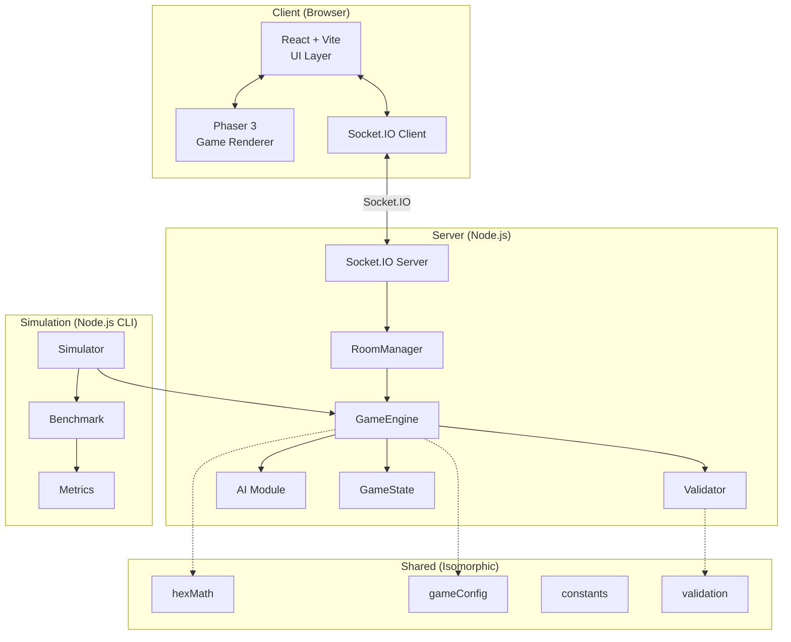
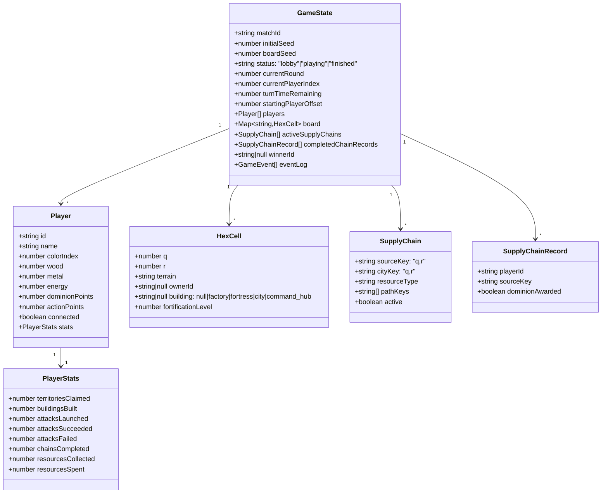
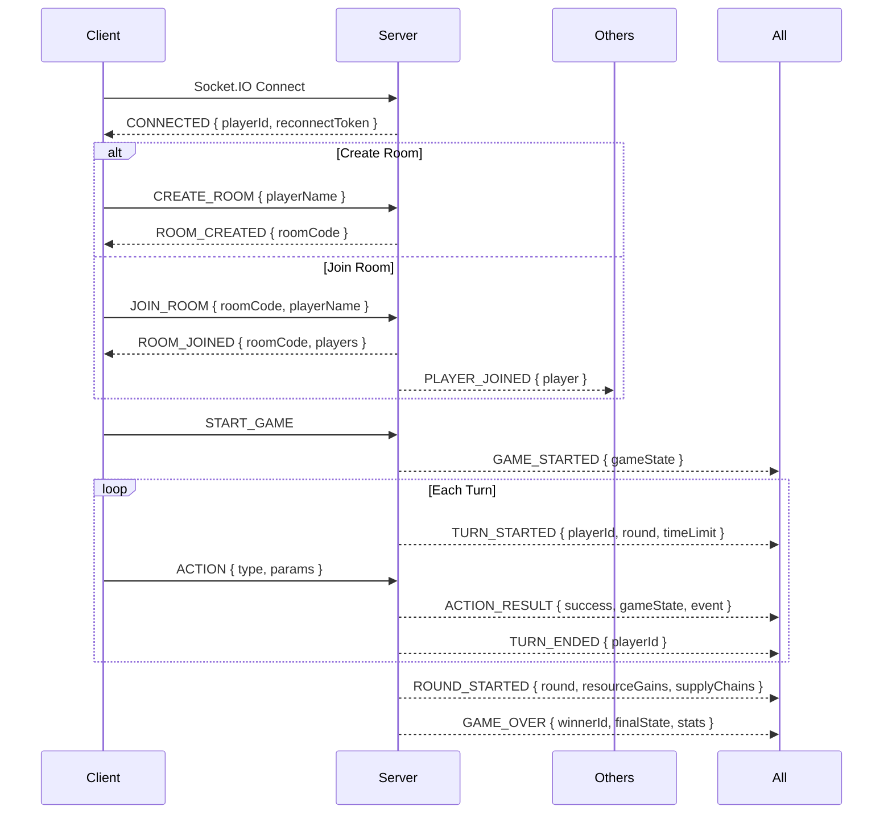
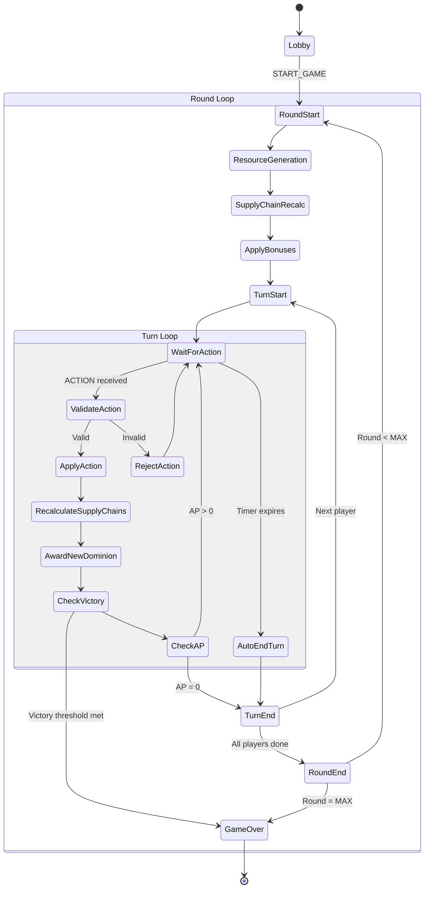

# NEXUS: DOMINION — Pre-Implementation Analysis

> [!IMPORTANT]
> This document is a **design-only** analysis. No code has been written. Every section identifies decisions that must be locked down before implementation begins.

> [!IMPORTANT]
> `decisions.md` is the authoritative decision register. Any earlier proposal in
> this analysis that differs from it is superseded; the sections below record the
> final approved design rather than rejected alternatives.

---

## 1. Final Rules and Resolved Questions

These questions are resolved by the specification and authoritative decision
register. They are retained as implementation rationale, not open choices.

### 1.1 Supply Chain Definition Ambiguity

**Final rule**: A valid source is Forest, Mine, or Energy Field owned by the
player and containing its own Factory. A Factory elsewhere on the path does not
activate it. The selected source connects by owned adjacency to its deterministic
BFS-selected City endpoint.

### 1.2 Supply Chain Uniqueness

**Final rule**: Each natural resource source supports at most one active chain,
with the selected endpoint determined by deterministic BFS distance and `(q, r)`
tie-breaking.

**Approved resolution**: Each natural resource source supports at most one active
chain. BFS considers all reachable owned Cities, selects the minimum graph-distance
City, then resolves equal-distance ties by lexicographically smallest `(q, r)`.
Different sources may connect to the same City.

### 1.3 Factory on Plains — Energy Production Interaction

**Spec says** (§12): Factory on Plains produces +1 Energy per round.

**Final rule**: A Plains Factory has local Energy production only and cannot be
a Supply Chain source.

**Approved resolution**: A Plains Factory produces +1 local Energy per round but
is never a Supply Chain source. Only Forest, Mine, and Energy Field qualify.

### 1.4 Building Stacking Rules

**Spec says**: Only one Factory per hex (§18), only one Fortress per hex (§19). City placement is restricted to Plains/City Site (§20).

**Ambiguity**: Can a hex have *both* a Factory and a Fortress? Can a City hex also have a Fortress? The spec doesn't say "only one building per hex" — it says "only one Factory per hex" and "only one Fortress per hex" separately.

**Approved resolution**: **One building per hex, period.** This creates a
meaningful production-versus-defense tradeoff.

> [!NOTE]
> This is a **major design decision** that significantly affects game balance. The alternative (allowing stacking) would make resource hexes with Fortress+Factory extremely strong and reduce strategic variety.

### 1.5 Command Hub Properties

**Spec says** (§21): Command Hub cannot be captured, cannot be removed.

**Ambiguity**: Does the Command Hub count as a "building" for the purpose of building placement? Can you build a Factory/Fortress/City on the Command Hub hex?

**Approved resolution**: The Command Hub is the permanent building occupying the
starting hex's sole building slot. It cannot be captured, removed, replaced, or
fortified.

### 1.6 Terrain Distribution Algorithm

**Final rule**: Board generation uses fixed terrain counts and deterministic
Mulberry32 placement plus a measurable fairness test.

**Approved resolution**: Every board uses exactly 25 Plains, 11 Forest, 11 Mine,
9 Energy Field, and 5 City Site hexes. The four starts consume four Plains.
Mulberry32, canonical coordinate ordering, and the explicit resource-distance
fairness test in the decision register make placement reproducible.

### 1.7 "Adjacent to at least one player-controlled hex" for Attacks

**Spec says** (§28): Target is adjacent to at least one attacker's hex. (§29): +1 when attacking player has **2 or more** directly adjacent friendly hexes.

**Ambiguity**: The base requirement is 1 adjacent hex. The bonus requires 2+. Is the bonus **+1 total** (flat), or **+1 per extra adjacent hex beyond the first**?

**Approved resolution**: **+1 flat bonus** when the attacker has 2+ adjacent
friendly hexes. The maximum Attack Strength of 6 confirms it does not scale.

### 1.8 When is Victory Checked?

**Spec says** (§38): "A player wins immediately if Dominion Points >= threshold."

**Ambiguity**: Is victory checked after every individual action, or only at the end of a turn/round?

**Approved resolution**: Follow the canonical action order: validate, spend,
apply, recalculate affected chains, award Dominion, then check victory. Victory
can therefore result from direct or newly completed-chain Dominion mid-turn.

### 1.9 Disconnected Player's Turn

**Spec says** (§46): Timer continues during disconnection.

**Ambiguity**: What happens when the timer expires and the player is still disconnected? Do they simply lose their turn (0 actions)? Are they replaced by AI?

**Approved resolution**: The turn **auto-ends** with no actions taken. No AI
replacement occurs; the player may reconnect on a later turn using their token.

### 1.10 Dominion Points from Claiming Starting Hex

**Spec says** (§16): "Starting territory does not award Dominion."

**Ambiguity**: Each player starts with exactly one hex (their Command Hub hex). Is this the only "starting territory", or do players begin with a cluster?

**Approved resolution**: Players start with **exactly one** Command Hub hex and
receive no Dominion for it. This remains provisional pending simulation and
playtesting; it is not empirically validated.

---

## 2. Proposed Architecture

### 2.1 High-Level Architecture



### 2.2 Key Architectural Decisions

| Decision | Choice | Alternative | Tradeoff |
|----------|--------|-------------|----------|
| State ownership | Server-authoritative | Client-authoritative | More server responsibility, but one validated authority |
| Client rendering | Phaser 3 scene embedded in React | Pure React Canvas | Phaser provides sprites/particles/animations natively |
| React ↔ Phaser bridge | React owns UI overlays; Phaser owns the hex board | Single renderer | Clean separation; React handles menus/HUD/modals, Phaser handles the game board |
| Shared code | Isomorphic JS modules imported by both client and server | Duplicate logic | Single source of truth for hex math, config, validation |
| Networking | Socket.IO | Raw WebSocket | Built-in transport reconnection and event messaging reduce infrastructure work; game-state restoration remains custom |
| AI execution | Server-side, same process | Separate worker | Simpler for 2-4 player scale; decision-time performance is a benchmark target, not a guarantee |
| Simulation | Reuses `GameEngine` directly, no network | Separate engine | Guarantees simulation matches real game rules |
| Database | SQLite for match history/benchmarks | In-memory only | Persists benchmark data; lightweight |

### 2.3 Final Layer Ownership

- **shared** contains pure deterministic hex, board, validation, combat,
  resource, and Supply Chain rules.
- **server** owns authoritative GameState transitions, rooms, timers,
  persistence, reconnect-token validation, and Socket.IO.
- **client** renders Phaser/React UI, sends requests, and replaces a read-only
  state mirror from the server.
- **simulation** runs headlessly through the same shared rules and GameEngine.

No core rule is reimplemented separately for client, server, or simulation.

> [!TIP]
> **Why Socket.IO?** It provides transport-level reconnection, fallback, and
> event-based messaging, reducing infrastructure work. Room rules and
> authoritative state restoration remain game-specific server responsibilities.

---

## 3. Proposed File Structure

```
nexus-dominion/
├── package.json                    # Monorepo root
├── gameConfig.json                 # Central balance configuration (§2.4)
│
├── shared/                         # Isomorphic code (runs on client + server)
│   ├── hexMath.js                  # Axial coordinate operations
│   ├── constants.js                # Enums: terrain, buildings, actions, phases
│   ├── gameConfig.js               # Loads + validates gameConfig.json
│   ├── validation.js               # Pure action-validation functions
│   ├── boardGenerator.js           # Seeded deterministic board generation
│   ├── supplyChain.js              # BFS-based Supply Chain detection
│   └── combat.js                   # Pure attack/defense calculation
│
├── server/                         # Node.js backend
│   ├── index.js                    # Entry point, HTTP + Socket.IO server
│   ├── RoomManager.js              # Room lifecycle (create, join, leave, reconnect)
│   ├── GameEngine.js               # Orchestrates turns, rounds, victory
│   ├── GameState.js                # Authoritative state container
│   ├── ActionProcessor.js          # Validates + applies actions (Claim, Build, Attack, Fortify)
│   ├── TurnManager.js              # Timer, turn rotation, round progression
│   ├── ResourceManager.js          # Resource generation, spending, Supply Chain bonuses
│   ├── AIController.js             # Dispatches AI turns
│   └── db.js                       # SQLite for match history + benchmarks
│
├── client/                         # React + Vite frontend
│   ├── index.html
│   ├── vite.config.js
│   ├── src/
│   │   ├── main.jsx                # React entry point
│   │   ├── App.jsx                 # Router: Menu → Lobby → Game → Victory
│   │   ├── networking/
│   │   │   ├── SocketClient.js     # Socket.IO connection and game-state restoration
│   │   │   └── messageTypes.js     # Shared message type constants
│   │   ├── ui/                     # React UI components
│   │   │   ├── MainMenu.jsx
│   │   │   ├── Lobby.jsx
│   │   │   ├── HUD.jsx
│   │   │   ├── ActionBar.jsx
│   │   │   ├── BuildMenu.jsx
│   │   │   ├── AttackPreview.jsx
│   │   │   ├── EventLog.jsx
│   │   │   ├── AIExplanation.jsx
│   │   │   ├── VictoryScreen.jsx
│   │   │   └── HowToPlay.jsx
│   │   ├── game/                   # Phaser 3 scenes + renderers
│   │   │   ├── PhaserGame.js       # Phaser.Game bootstrap + React bridge
│   │   │   ├── GameScene.js        # Main Phaser scene
│   │   │   ├── HexRenderer.js      # Hex grid drawing (axial → pixel)
│   │   │   ├── TerrainRenderer.js  # Terrain-specific visuals
│   │   │   ├── TerritoryRenderer.js# Ownership borders + tints
│   │   │   ├── BuildingRenderer.js # Building sprites + animations
│   │   │   ├── SupplyChainRenderer.js # Glowing path visualization
│   │   │   ├── EffectsManager.js   # Particles, flashes, transitions
│   │   │   └── CameraController.js # Pan/zoom
│   │   ├── state/                  # Client-side state (mirror of server state)
│   │   │   └── gameStore.js        # Zustand or simple store for UI reactivity
│   │   └── assets/                 # Sprites, sounds, fonts
│   │       ├── terrain/
│   │       ├── buildings/
│   │       ├── effects/
│   │       └── audio/
│
├── simulation/                     # Headless simulation + benchmarking
│   ├── Simulator.js                # Runs full games without rendering
│   ├── ai/
│   │   ├── RandomAI.js
│   │   ├── GreedyAI.js
│   │   └── StrategicAI.js
│   ├── Benchmark.js                # Runs N games, collects metrics
│   ├── Metrics.js                  # Statistical aggregation
│   ├── BalanceExperiment.js        # Parameter sweep experiments
│   └── results/                    # Output directory for benchmark data
│
└── tests/
    ├── hex.test.js
    ├── board.test.js
    ├── claim.test.js
    ├── build.test.js
    ├── combat.test.js
    ├── resources.test.js
    ├── supplyChain.test.js
    ├── turns.test.js
    ├── victory.test.js
    ├── validation.test.js
    ├── ai.test.js
    └── multiplayer.test.js
```

> [!NOTE]
> The `shared/` directory is the **most important architectural boundary**. By placing hex math, config, validation, combat, and Supply Chain logic here, we guarantee that:
> 1. Server and client use identical rules.
> 2. The simulation engine uses the real game logic (not a reimplementation).
> 3. Client-side previews (attack preview, build validity) match server behavior.

---

## 4. State Model

### 4.1 Authoritative `GameState` (Server)



### 4.2 Key for Hex Storage

Hexes are stored internally in a `Map<string, HexCell>` keyed by `"q,r"`. This
gives O(1) lookup; the wire serializer converts it to the canonical board-cell
array before transmission.

**Why not a 2D array?** Axial coordinates include negative values (range -4 to +4). A Map avoids offset arithmetic internally. The canonical wire format does not serialize the Map directly: it emits a sorted array of board-cell objects.

### 4.3 Client State (Mirror)

The client maintains a **read-only mirror** of the game state, updated only through server messages. The client never mutates this state directly. React UI components subscribe to this mirror via a lightweight store (Zustand or a simple EventEmitter pattern).

The client may additionally track:
- Selected hex
- Current action mode (claim/build/attack/fortify)
- Hover state
- Animation queue
- Local UI preferences (mute, etc.)

---

## 5. Multiplayer Protocol

### 5.1 Connection Lifecycle



### 5.2 Message Types (Client → Server)

| Message | Payload | When |
|---------|---------|------|
| `CREATE_ROOM` | `{ playerName }` | Main menu |
| `JOIN_ROOM` | `{ roomCode, playerName }` | Main menu |
| `START_GAME` | `{ mode: "normal"|"demo" }` | Lobby (host only) |
| `ACTION` | `{ type: "claim"|"build"|"attack"|"fortify"|"end_turn", params }` | During player's turn |
| `RECONNECT` | `{ roomCode, playerId, reconnectToken }` | After disconnect |

### 5.3 Message Types (Server → Client)

| Message | Payload | When |
|---------|---------|------|
| `CONNECTED` | `{ playerId, reconnectToken }` | On Socket.IO connection |
| `ROOM_CREATED` | `{ roomCode }` | After CREATE_ROOM |
| `ROOM_JOINED` | `{ roomCode, players[] }` | After JOIN_ROOM |
| `PLAYER_JOINED` | `{ player }` | Broadcast to room |
| `PLAYER_LEFT` | `{ playerId }` | Broadcast to room |
| `GAME_STARTED` | `{ fullGameState }` | Broadcast on start |
| `TURN_STARTED` | `{ playerId, round, turnNumber, timeRemaining }` | Each turn |
| `ACTION_RESULT` | `{ success, error?, gameState, event }` | After accepted action |
| `TURN_ENDED` | `{ playerId, reason: "manual"|"timeout"|"no_ap" }` | End of turn |
| `ROUND_STARTED` | `{ round, resourceGains, supplyChainUpdates }` | Start of round |
| `GAME_OVER` | `{ winnerId, reason, finalStats }` | Game end |
| `STATE_SYNC` | `{ fullGameState }` | Reconnection |
| `PLAYER_DISCONNECTED` | `{ playerId }` | Broadcast |
| `PLAYER_RECONNECTED` | `{ playerId }` | Broadcast |
| `ERROR` | `{ code, message }` | Validation failure |

### 5.4 State Update Strategy

Every accepted action broadcasts the complete authoritative JSON GameState plus
event metadata. The client replaces its read-only mirror with the received state
and uses event metadata for targeted animation.

```js
{
  success: true,
  gameState: { board: [{ q: -3, r: 0, terrain: "plains", ownerId: "p1", building: null, fortificationLevel: 0 }] },
  event: { action: "claim", playerId: "p1", hex: { q: -3, r: 0 }, dominionAwarded: 1 }
}
```

Full-state delivery prioritizes correctness and simple recovery on a 61-hex
board. No delta-application or checksum protocol is required.

---

## 6. Core Algorithms

### 6.1 Hex Math (Axial Coordinates)

```
Coordinate system: (q, r) axial
Valid hex: max(|q|, |r|, |q+r|) <= 4
Distance: (|q1-q2| + |r1-r2| + |q1+r1-q2-r2|) / 2
Neighbors: 6 fixed direction vectors
Pixel conversion: pointy-top orientation
  x = size * (sqrt(3) * q + sqrt(3)/2 * r)
  y = size * (3/2 * r)
```

### 6.2 Board Generation (Seeded)

1. Enumerate all 61 valid hexes in lexicographic `(q, r)` order.
2. Reserve the four fixed starting hexes as Plains.
3. Use Mulberry32 to shuffle 21 Plains, 11 Forest, 11 Mine, 9 Energy Field, and 5 City Site tokens.
4. Assign tokens to the remaining coordinates in canonical order.
5. Require every start to have Forest, Mine, and Energy Field within distance 3 and require the maximum difference in three-resource distance sums to be at most 2.
6. On failure, derive `nextSeed = (seed + 0x9E3779B9) >>> 0` and retry; record the accepted board seed.

### 6.3 Supply Chain Detection (BFS)

```
function findSupplyChains(player, board):
    chains = []
    resourceHexes = player's hexes with (Forest/Mine/Energy Field AND Factory)
    cities = player's hexes with City building

    for each resourceHex:
        reachableCities = BFS from resourceHex through player-owned hexes
        select the minimum-distance reachable city; break ties by lexicographic (q, r)
        chains.push({ source: resourceHex, city: selectedCity, path: BFS_path })

    return chains
```

**Time complexity**: O(V + E) per BFS on player territory. With max ~61 hexes, this is trivially fast.

### 6.4 AI Heuristic Evaluation

```
score(action) = Σ (weight_i × feature_i)

Features:
  - dominion_gain: immediate Dominion Points from action
  - resource_gain: net resource benefit
  - chain_completion: does this action complete a Supply Chain?
  - chain_disruption: does attacking break an opponent's chain?
  - defensive_value: is the target strategically important to defend?
  - threat_proximity: distance to nearest enemy territory
  - expansion_value: how many new neighbors does this open up?
  - resource_cost: normalized cost of the action

All weights loaded from gameConfig.json.
```

---

## 7. Game Flow — Turn & Round Lifecycle



---

## 8. Viva-Challengeable Design Decisions

Every decision below could be questioned by an examiner. For each, I list the decision, the rationale, the strongest counter-argument, and how to defend it.

### 8.1 "Why only one building per hex?"

- **Decision**: One building slot per hex (§1.4 above — our interpretation).
- **Rationale**: Forces strategic tradeoff between production and defense. Factory+Fortress stacking would be dominant, reducing meaningful choice.
- **Counter**: "But the spec never says one building per hex. You added a restriction."
- **Defense**: The spec says one Factory per hex and one Fortress per hex *individually*. We chose the most conservative interpretation. We can show through simulation that stacking reduces strategic diversity (measure decision entropy in games with/without stacking).

### 8.2 "Why full state plus event metadata?"

- **Decision**: Broadcast full authoritative state after every accepted action plus event metadata.
- **Counter**: "Deltas would use less bandwidth."
- **Defense**: A 61-hex state is small enough to prioritize correctness and a
  simple read-only client mirror. Event metadata targets animations without
  client-side diffing or fragile delta application.

### 8.3 "Why BFS and not Dijkstra/A* for Supply Chains?"

- **Decision**: BFS for connectivity checking.
- **Counter**: "What if you need the shortest path for visualization?"
- **Defense**: §79 explicitly states "shortest path is NOT required for basic chain validation." BFS already returns a path (the BFS tree path). For visualization, we use any valid path. If future versions need shortest-path logistics, we add Dijkstra without changing the connectivity check.

### 8.4 "Why Zustand / simple store instead of Redux?"

- **Decision**: Lightweight state management on the client.
- **Counter**: "Redux has devtools, time-travel debugging, middleware."
- **Defense**: The client state is a *read-only mirror* of the server. There are no complex client-side state transitions. Redux's overhead (action creators, reducers, middleware) is unnecessary when the only "action" is "server sent new state, update the mirror." A simple store with subscriptions suffices.

### 8.5 "Why Socket.IO?"

- **Decision**: Socket.IO with custom game-room and state-restoration logic.
- **Counter**: "Raw WebSocket is a smaller dependency."
- **Defense**: Socket.IO handles transport-level reconnection and event delivery,
  reducing non-game infrastructure. The server still owns room constraints,
  authoritative state, and reconnect-token validation.

### 8.6 "Why is combat deterministic? Doesn't that remove excitement?"

- **Decision**: No dice, no randomness.
- **Counter**: "Randomness creates drama and replayability."
- **Defense**: The spec mandates determinism (§2.3). But strategically: the excitement comes from *positional uncertainty* and *opponent decision uncertainty*, not dice rolls. You don't know what your opponent will do — that's the real uncertainty. Deterministic combat makes planning meaningful. A player can see "if I fortify this hex, it becomes unattackable" — that's strategic depth.

### 8.7 "Why 2 Action Points and not more?"

- **Decision**: 2 AP per turn (spec §15).
- **Counter**: "With only 2 actions, turns feel too constrained."
- **Defense**: 2 AP with a 25-second timer means each decision matters. More AP would either require longer turns (dragging game duration) or feel rushed. 2 AP creates a *meaningful constraint* — you must choose between expanding, building, attacking, or fortifying. This is the core strategic tension. Balance experiments (§55) will validate whether 2 is correct.

### 8.8 "Why not use a 2D array for the hex grid?"

- **Decision**: `Map<string, HexCell>` keyed by `"q,r"`.
- **Counter**: "A 2D array with offset is faster for random access."
- **Defense**: Both are O(1) lookup. The Map avoids negative-index arithmetic (q and r range from -4 to +4). Serialization to JSON is trivial. The board has only 61 cells — performance differences are immeasurable. The Map representation is more readable and less error-prone.

### 8.9 "How do you prevent the first player from always winning?"

- **Decision**: Rotate starting player each round (§36-37).
- **Counter**: "Rotation doesn't fully eliminate first-mover advantage."
- **Defense**: Correct — rotation *mitigates* but doesn't eliminate it. The spec requires us to *measure* first-player advantage (§56) through simulation. If position 1 has >30% win rate in a 4-player game (expected: 25%), we adjust starting resources or board layout. This is an empirical question, not a theoretical one.

### 8.10 "Why three AI tiers instead of one good AI?"

- **Decision**: Random, Greedy, Strategic (§53).
- **Counter**: "Just make one good AI."
- **Defense**: The three tiers serve as *baselines for evaluation*. Random AI is the null hypothesis. Greedy AI tests whether local optimization suffices. Strategic AI is evaluated *relative to these baselines*. Without baselines, we can't claim Strategic AI is "good" — we can only claim it "works." With baselines, we can quantify: "Strategic AI wins X% more than Greedy, which wins Y% more than Random." This is the scientific contribution.

### 8.11 "What if the Supply Chain mechanic is too powerful or too weak?"

- **Decision**: +2 resource bonus per active chain, +4/+2 Dominion for completion (§24, §26).
- **Counter**: "How do you know these numbers are balanced?"
- **Defense**: We don't — *a priori*. That's why the spec mandates configurable balance parameters (§2.4) and simulation-based balance experiments (§55). We will run 500+ simulated games, vary Supply Chain bonus values, and measure win-rate distribution and resource accumulation curves. The final values will be justified by experimental data, not guesswork.

---

## 9. Implementation Plan (Phased)

### Phase 1: Core Engine (Estimated: Days 1-3)
- `shared/hexMath.js` — all coordinate operations
- `shared/boardGenerator.js` — seeded board generation
- `shared/gameConfig.js` — load and validate config
- `shared/constants.js` — enums
- `server/GameState.js` — state container
- `server/ActionProcessor.js` — Claim action only
- `server/TurnManager.js` — turn/round rotation
- `server/ResourceManager.js` — basic resource generation
- Tests for hex math, board generation, claim action
- **Milestone**: Single-player loop (claim territories, generate resources, turns rotate)

### Phase 2: Infrastructure (Estimated: Days 4-5)
- Build action: Factory, Fortress, City
- Resource spending validation
- Factory production bonuses
- Fortification mechanic
- Tests for all building types, placement rules, resource costs
- **Milestone**: Full economic gameplay in single-player loop

### Phase 3: Supply Chains (Estimated: Days 6-7)
- `shared/supplyChain.js` — BFS connectivity
- Supply Chain detection after Claim, Build, and Attack, with round-start confirmation
- Fixed neighbor traversal, shortest reachable-City selection, and lexicographic tie-breaking
- One active chain per natural source and `(playerId, sourceHex)` reward history
- Supply Chain bonuses applied to resource generation
- Supply Chain breakage/restoration tracking
- Supply Chain Dominion rewards (first: +4, subsequent: +2)
- Tests for valid/broken/restored chains
- **Milestone**: Supply Chain mechanic fully functional

### Phase 4: Combat (Estimated: Day 8)
- `shared/combat.js` — pure attack/defense functions
- Attack action in ActionProcessor
- Attack strength calculation (base + support + chain bonus)
- Defense strength calculation (base + fortress + city + fortification)
- Ownership transfer, building destruction
- Dominion rewards for captures
- Tests for all combat scenarios
- **Milestone**: Territorial conflict works

### Phase 5: Multiplayer (Estimated: Days 9-12)
- `server/index.js` — HTTP + Socket.IO server
- `server/RoomManager.js` — room lifecycle
- `client/networking/SocketClient.js` — Socket.IO connection and state restoration
- Protocol implementation (all message types)
- Full authoritative JSON state plus event metadata after each accepted action
- Turn timer (server-side)
- Reconnection with roomCode, playerId, and reconnectToken
- Client state mirror + store
- Tests for multiplayer scenarios
- **Milestone**: 2-4 humans play a complete match

### Phase 6: Client UI + Rendering (Estimated: Days 13-18)
- Phaser 3 game scene with hex grid
- React UI: MainMenu, Lobby, HUD, ActionBar, BuildMenu, AttackPreview, EventLog
- React ↔ Phaser bridge
- Terrain rendering (placeholder → polished)
- Territory borders + ownership tint
- Building sprites
- Supply Chain visualization
- Basic animations (claim, build, attack)
- Victory screen
- **Milestone**: Playable with polished UI

### Phase 7: AI (Estimated: Days 19-21)
- `simulation/ai/RandomAI.js`
- `simulation/ai/GreedyAI.js`
- `simulation/ai/StrategicAI.js` — full heuristic
- `server/AIController.js` — integrate AI into game turns
- AI explanation system
- `AIExplanation.jsx` — "WHY THIS MOVE?" UI
- Tests for AI legality, determinism
- **Milestone**: AI plays complete matches with explainable decisions

### Phase 8: Simulation & Benchmarking (Estimated: Days 22-24)
- `simulation/Simulator.js` — headless game runner
- `simulation/Benchmark.js` — batch game execution
- `simulation/Metrics.js` — statistical aggregation
- `simulation/BalanceExperiment.js` — parameter sweeps
- First-player advantage test
- AI comparison (Random vs Greedy vs Strategic)
- Results export + charts
- **Milestone**: 500+ games benchmarked, data supports balance decisions

### Phase 9: Visual Polish + Audio (Estimated: Days 25-28)
- Custom terrain artwork
- Particle effects
- Building animations (holographic construction)
- Attack animations (energy beam, shield)
- Supply Chain glow effects
- Territory capture transitions
- Resource floating indicators
- Sound effects
- Mute button
- **Milestone**: "Small game, premium presentation"

### Phase 10: Testing & Deployment (Estimated: Days 29-30)
- Full regression test suite
- Cross-browser testing
- Deployment to hosting environment
- Demo mode validation
- Final balance tuning based on simulation data
- **Milestone**: Production-ready for viva demonstration

---

## 10. Risk Register

| Risk | Impact | Mitigation |
|------|--------|------------|
| Phaser ↔ React integration complexity | High | Establish the bridge pattern in Phase 1 with a minimal prototype |
| Supply Chain BFS performance on every round | Low | 61 hexes, BFS is O(V+E) ≈ O(61+366) ≈ trivial |
| Socket.IO reconnection edge cases | Medium | Server validates roomCode, playerId, and reconnectToken; full state is restored after reconnection |
| Balance parameters too skewed | Medium | All values in config; simulation pipeline enables rapid iteration |
| Phaser 3 learning curve | Medium | Use Phaser for rendering only; game logic stays in shared/ |
| AI taking too long on turn | Low | Benchmark decision time against a configured performance target before making claims |
| Scope creep from "one more feature" | High | Spec §88 is explicit: do not invent mechanics. Treat spec as authoritative |

---

## 11. Final Approved Decision Summary

The following rules are locked by `decisions.md`; implementation begins only
after explicit user approval:

1. **One building per hex** (Factory OR Fortress OR City, not combinations)
2. **Factory must be on the source hex** for Supply Chains (not elsewhere on path)
3. **Plains + Factory** produces local Energy only; it cannot source a chain
4. **Command Hub** occupies its building slot and cannot be fortified
5. **Victory checked after every Dominion-granting action** (mid-turn)
6. **Disconnected player's turn auto-ends** (no AI replacement)
7. **Players start with exactly 1 hex** (Command Hub hex only)
8. **Socket.IO for transport and reconnection**
9. **Full authoritative state plus event metadata after accepted actions**
10. **Fixed terrain counts with deterministic fairness validation**
11. **One active Supply Chain per natural resource source**, selected by BFS distance and `(q, r)` tie-break
12. **Immediate chain recalculation** after Claim, Build, and Attack, before Dominion/victory processing
